# 🔐 Awesome Public Key Infrastructure & Identity Federation

<p align="center">
  
</p>

<p align="center">
  <a href="https://github.com/ishandutta2007/Awesome-Awesome-Awesome"></a><a href="https://discord.gg/jc4xtF58Ve"></a>
  <a href="https://github.com/ishandutta2007/Awesome-Public-Key-Infrastructure-Identity-Federation/stargazers"></a>
  <a href="https://github.com/ishandutta2007/Awesome-Public-Key-Infrastructure-Identity-Federation/network/members"></a>
  <a href="https://github.com/ishandutta2007/Awesome-Public-Key-Infrastructure-Identity-Federation/blob/main/LICENSE"></a>
  <a href="https://github.com/ishandutta2007"></a>
</p>

## 📌 Comprehensive Public Key Infrastructure (PKI) & Identity Federation Ecosystem

> **Curated directory of enterprise SaaS solutions, machine identity platforms, and open-source PKI/certificate management tools.**

**Last updated: October 2026**

Welcome to the definitive awesome list for **Public Key Infrastructure (PKI)**, **Identity Federation**, **Machine Identity Management**, and **Certificate Lifecycle Automation**. This repository tracks leading commercial SaaS platforms and open-source software that issue, manage, and rotate X.509 certificates and cryptographic keys to enable zero-trust security across microservices, cloud workloads, and IoT devices.

---

## 📑 Table of Contents
- [📊 SaaS & Hosted Platforms](#-saas--hosted-platforms)
- [🔓 Open-Source GitHub Projects](#-open-source-github-projects)
  - [🛡️ Workload Identity & Zero-Trust](#️-workload-identity--zero-trust)
  - [🏛️ Certificate Authorities & PKI Engines](#️-certificate-authorities--pki-engines)
  - [🔑 Identity Providers & Federation](#-identity-providers--federation)
  - [🛠️ Cryptography & Security Toolkits](#️-cryptography--security-toolkits)
- [🤝 How to Contribute](#-how-to-contribute)
- [💖 Support & Sponsorship](#-support--sponsorship)
- [📈 Star History](#-star-history)
- [⚠️ Disclaimer](#️-disclaimer)

---

## 📊 SaaS & Hosted Platforms

> **Market Analysis & Industry Overview**:  
> The global Machine Identity Management and PKI market size is estimated at **$2.5 Billion to $4.0 Billion** (2026), expanding at a CAGR of 16-20% driven by cloud-native microservices and zero-trust security mandates. The sector is **moderately fragmented** with category leaders in workforce identity (Okta) and enterprise machine identity (Venafi/CyberArk, Keyfactor), alongside rapidly growing zero-knowledge secrets management providers (Akeyless, HashiCorp HCP).

*(Sorted by Company Size / Market Valuation descending)*

| Platform | Description | Estimated Valuation / Revenue | Starting Pricing | Free Tier Limit | Best For |
| :--- | :--- | :--- | :--- | :--- | :--- |
| **[AWS Roles Anywhere](https://aws.amazon.com/rolesanywhere/)** ☁️ | IAM Roles Anywhere using X.509 certificates to access AWS resources | ~$1.8 Trillion (Amazon Market Cap) | Free service (ACM Private CA required: $400/month or $50/month for short-lived CA) | 30-day free trial for AWS Private CA (first CA is free for 30 days) | Hybrid AWS access |
| **[CyberArk Conjur Enterprise](https://www.cyberark.com/)** 🛡️ | Enterprise secrets management, PKI policy-as-code & identity security | ~$11.5 Billion (Market Cap) | Custom workload identity licensing / AWS Private Offer | Conjur Open Source (OSS) free edition (no duration limit) | Enterprise secrets & PAM |
| **[Okta Workforce Identity](https://www.okta.com/)** 👤 | Identity federation, SSO, SAML, OIDC & directory integration | ~$11.0 Billion (Market Cap) | $6.00/user/month (Starter Plan) | 30-day free trial | Workforce identity & SSO |
| **[HashiCorp Vault (HCP)](https://www.hashicorp.com/products/vault)** 🗝️ | Cloud-managed Vault with PKI secrets engine & certificate authority | ~$6.4 Billion (IBM acquisition) | $0.62/hour (Development tier) or $1.58/hour + $72.92/client/month (Essentials) | $500 free trial credits (Dev cluster capped at 25 clients) | Vault users & multi-cloud |
| **[Venafi](https://venafi.com/)** 🏢 | Enterprise machine identity management & certificate lifecycle automation | ~$1.5 Billion (Acquired by CyberArk) | Custom enterprise licensing / AWS Private Offer | 30-day free trial (TLS Protect Cloud evaluation) | Large enterprises |
| **[Keyfactor](https://www.keyfactor.com/)** 🔐 | Machine & IoT identity platform, PKI, certificate management & code signing | ~$1.3 Billion (Insight Partners valuation) | Contract-based subscription / AWS Private Offer | 30-day free trial (EJBCA SaaS evaluation) | Enterprise and IoT PKI |
| **[Akeyless](https://www.akeyless.io/)** ⚡ | SaaS secrets management with PKI & zero-knowledge Vaultless architecture | ~$300 Million (Series B valuation) | Consumption-based pricing / Custom Enterprise plan | Free Tier forever (up to 5 clients, 500 static secrets, 5 dynamic/rotated secrets) | Hybrid & multi-cloud secrets |

---

## 🔓 Open-Source GitHub Projects

The open-source ecosystem provides robust certificate authorities, workload identity control planes, and identity providers.

*(Sorted by GitHub Star Count descending within each category)*

### 🛡️ Workload Identity & Zero-Trust

- **[Keycloak](https://github.com/keycloak/keycloak)** [](https://github.com/keycloak/keycloak/stargazers)  
  👑 **The leading open-source identity provider** — SSO, MFA, OIDC, SAML, and identity brokering. **Best for identity federation**.

- **[Teleport](https://github.com/gravitational/teleport)** [](https://github.com/gravitational/teleport/stargazers)  
  ⚡ **Identity-based access for infrastructure** — Certificate-based access to SSH, Kubernetes, databases, and web apps without static credentials. **Best for zero-trust infrastructure access**.

- **[Cert-Manager](https://github.com/cert-manager/cert-manager)** [](https://github.com/cert-manager/cert-manager/stargazers)  
  ☸️ **Kubernetes certificate management** — Automates X.509 TLS certificate issuance & renewal from Let's Encrypt, Vault, Venafi, and private CAs. **Best for Kubernetes certificates**.

- **[Authentik](https://github.com/goauthentik/authentik)** [](https://github.com/goauthentik/authentik/stargazers)  
  🔐 **Flexible open-source identity provider** — OAuth2, SAML, LDAP, and proxy support with customizable flows. **Best for modern identity federation**.

- **[Smallstep / step-ca](https://github.com/smallstep/certificates)** [](https://github.com/smallstep/certificates/stargazers)  
  📜 **Modern open-source certificate authority** — ACME, OIDC, and mTLS certificate issuance with `step-ca`. **Best for modern PKI & automated certificate issuance**.

- **[SPIFFE / SPIRE](https://github.com/spiffe/spire)** [](https://github.com/spiffe/spire/stargazers)  
  🌐 **The CNCF standard for cryptographic workload identity** — SPIFFE ID framework with SPIRE server/agent for automatic certificate rotation & node attestation. **Best for zero-trust workload identity**.

- **[OpenBao](https://github.com/openbao/openbao)** [](https://github.com/openbao/openbao/stargazers)  
  📦 **Linux Foundation community fork of HashiCorp Vault** — Open-governance PKI secrets engine and sensitive data management. **Best for open-source Vault PKI**.

---

### 🏛️ Certificate Authorities & PKI Engines

- **[CFSSL](https://github.com/cloudflare/cfssl)** [](https://github.com/cloudflare/cfssl/stargazers)  
  ☁️ **Cloudflare's PKI and TLS toolkit** — Certificate signing, verification, HTTP API server, and bundling toolkit. **Best for custom PKI toolchains**.

- **[EJBCA](https://github.com/Keyfactor/ejbca-ce)** [](https://github.com/Keyfactor/ejbca-ce/stargazers)  
  🏢 **Enterprise Java Bean Certificate Authority** — Industrial-strength CA with OCSP, SCEP, EST, and ACME support. **Best for enterprise-grade self-hosted CAs**.

- **[Boulder](https://github.com/letsencrypt/boulder)** [](https://github.com/letsencrypt/boulder/stargazers)  
  🔒 **Let's Encrypt ACME CA implementation** — Scalable ACME protocol server implementation in Go. **Best for public & private ACME CA deployments**.

- **[XCA](https://github.com/chris2511/xca)** [](https://github.com/chris2511/xca/stargazers)  
  🖥️ **X Certificate and Key Management** — Graphical user interface for handling RSA/ECC keys, certificates, and CAs. **Best for desktop PKI management**.

- **[OpenXPKI](https://github.com/openxpki/openxpki)** [](https://github.com/openxpki/openxpki/stargazers)  
  ⚙️ **Enterprise-grade PKI workflow engine** — Perl-based modular CA with flexible policy workflow management. **Best for complex enterprise PKI workflows**.

- **[Dogtag PKI](https://github.com/dogtagpki/pki)** [](https://github.com/dogtagpki/pki/stargazers)  
  🎩 **Red Hat Enterprise PKI system** — Full-featured certificate system supporting CRLs, OCSP, TPM, and smartcards. **Best for enterprise Linux PKI**.

---

### 🔑 Identity Providers & Federation

- **[Zitadel](https://github.com/zitadel/zitadel)** [](https://github.com/zitadel/zitadel/stargazers)  
  🚀 **Cloud-native identity infrastructure** — Multi-tenant identity management with OIDC, OAuth2, SAML2, and SCIM support. **Best for B2B identity & tenant isolation**.

- **[Authelia](https://github.com/authelia/authelia)** [](https://github.com/authelia/authelia/stargazers)  
  🛡️ **Single Sign-On & Two-Factor Authentication companion** — Lightweight authentication server for reverse proxies (Traefik, Nginx, Caddy). **Best for self-hosted SSO**.

- **[Dex](https://github.com/dexidp/dex)** [](https://github.com/dexidp/dex/stargazers)  
  🆔 **Open-source OIDC identity provider** — Federated identity connector for Kubernetes and cloud infrastructure via LDAP, SAML, and OAuth2. **Best for Kubernetes OIDC federation**.

- **[Ory Kratos](https://github.com/ory/kratos)** [](https://github.com/ory/kratos/stargazers)  
  🌌 **Headless identity & user management system** — First-principles identity provider supporting MFA, passwordless, and social login. **Best for API-first identity architecture**.

---

### 🛠️ Cryptography & Security Toolkits

- **[OpenSSL](https://github.com/openssl/openssl)** [](https://github.com/openssl/openssl/stargazers)  
  🛠️ **The foundational SSL/TLS & cryptography toolkit** — Essential CLI and software library for X.509 certificate generation.

- **[mkcert](https://github.com/FiloSottile/mkcert)** [](https://github.com/FiloSottile/mkcert/stargazers)  
  ✨ **Simple zero-config local development CA** — Automatically creates and installs a local CA in system trust stores. **Best for local dev HTTPS**.

- **[Cosign / Sigstore](https://github.com/sigstore/cosign)** [](https://github.com/sigstore/cosign/stargazers)  
  ✍️ **Container signing & Keyless PKI infrastructure** — Artifact signing, verification, and OIDC-backed ephemeral certificates. **Best for supply chain security**.

---

## 🏗️ Architecture Blueprint: Open-Source Zero-Trust PKI Stack

```
                     ┌────────────────────────┐
                     │   Identity Provider    │
                     │  (Keycloak / Zitadel)  │
                     └───────────┬────────────┘
                                 │ OIDC / SAML
                                 ▼
 ┌───────────────────┐    ┌──────────────┐    ┌────────────────────┐
 │ Kubernetes mTLS   │◄───┤  step-ca /   ├─►│ Workload Identity  │
 │ (Cert-Manager)    │    │ Vault PKI    │    │ (SPIFFE / SPIRE)   │
 └───────────────────┘    └──────────────┘    └────────────────────┘
                                 │ ACME / mTLS
                                 ▼
                     ┌────────────────────────┐
                     │ Zero-Trust Access Mesh │
                     │  (Teleport / Authelia) │
                     └────────────────────────┘
```

---

## 🤝 How to Contribute

Contributions are welcome! Please follow these simple guidelines:

1. Fork this repository.
2. Add your entry to `README.md` following the table/badge markdown layout.
3. Ensure open-source projects include official GitHub links and descriptions.
4. Submit a Pull Request with a clear description of the project.

Check out [Awesome-Awesome-Awesome](https://github.com/ishandutta2007/Awesome-Awesome-Awesome) for more curated lists!

---

## 💖 Support & Sponsorship

If you find this repository helpful for your security team or organization, consider supporting the maintainer:

- ⭐ **Star this repository** to help others discover it!
- 🔀 **Fork it** and contribute new PKI / Identity tools.
- 📢 **Share it** on LinkedIn, Twitter/X, or Reddit.
- ☕ **Buy me a coffee**: Sponsor via [GitHub Sponsors](https://github.com/sponsors/ishandutta2007).

Thank you for supporting open-source security! ❤️

---

## 📈 Star History

[](https://star-history.dera.page/#ishandutta2007/Awesome-Public-Key-Infrastructure-Identity-Federation&type=date&legend=top-left)

---

## ⚠️ Disclaimer

- This list is **community-curated** for educational and reference purposes and does not constitute formal financial or security advice.
- PKI platforms manage sensitive root private keys; proper security practices, Hardware Security Modules (HSMs), and key ceremony procedures should be followed in production environments.
- Always review license terms (Apache-2.0, MPL-2.0, MIT, BSL) prior to commercial deployment.

---

<p align="center">
  <b>Built with ❤️ for Security Engineers, DevSecOps Teams, and PKI Architects.</b>
</p>
